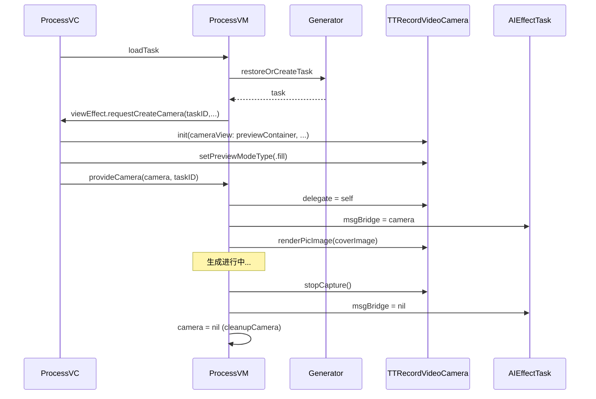

# 技术方案与 API 设计 v1.0

> **说明**：这是一个完整填充的 tech_design.md 样例（基于 AI Effect Camera 架构迁移场景），供 AI 生成时参照格式和质量标准。

## 1. 架构特征分析
- **强制工具类**: UI 约束使用 SnapKit；暗黑模式/字体使用 `UIColor.ttColor(withName:)`、`UIFont.ttMediumXX`；日志通过 `AIEffectMonitor.shared.log`
- **架构模式**: Process 侧为 MVI-ish（Intent/State/Effect）+ VC 仅做 UI/绑定；Generator 偏服务化单例（Task/Workflow 管理）
- **依赖约束**: VM 不直接持有/创建 UIKit 视图；不新增无必要实体（不新增 cameraController/factory 类型）；`TTRecordVideoCamera` 初始化强依赖 `cameraView`

## 2. 审查发现 (Review Findings)
- **PM 缺口检查**: 迁移 camera 后必须保证 `.idle` 新建任务的生成启动仍可用。退后台生成（NLE 渲染）要求 camera 必须及时销毁。
- **架构一致性检查**: 方案 2（VM 创建 camera）会迫使 VM 触达 UIKit，违背约束；最终收敛到方案 1（VC 创建 camera，回传给 VM 持有）。
- **设计隔离检查**:
  - AIEffectProcessViewController: What=UI与交互 | How=响应ViewEffect创建camera+管理preview | Depends=[VM, TTRecordVideoCamera] → ✅
  - AIEffectProcessViewModel(camera部分): What=camera生命周期管理 | How=provideCamera/cleanupCamera/delegate | Depends=[TTRecordVideoCamera, AIEffectTask] → ✅
  - AIEffectGenerator: What=Task/Workflow生命周期 | How=createTask/cleanupTask/deferVideoRendering | Depends=[AIEffectWorkflow, AIEffectTask] → ✅ (camera职责已剥离)

## 3. 设计决策记录
| 争议点 | 讨论摘要 | 最终选择 | 理由 |
|:-------|:---------|:---------|:-----|
| previewContainerView 插入方式 | A) 新增专门方法; B) 在现有 addSubviews/setupConstraints 中一并完成 | 选项 B | 不新增额外方法和控制变量，减少 VC 膨胀 |
| VM provideCamera 的校验策略 | A) 仅校验 taskID; B) 校验 taskID + phase | 选项 A | phase 校验复杂度高但无实际收益，taskID 足够防错配 |
| camera delegate 组织方式 | A) 在 VM 主体内实现; B) 用 extension 独立组织 | 选项 B | 代码组织清晰，不增加 VM 主体复杂度 |

### 方案修订要点（基于反馈的约束收敛）
- 不新增 `AIEffectCameraSetupContext` 之类的独立实体：ViewEffect 直接携带必要参数
- previewContainerView / previewMaskView 在现有 `addSubviews` / `setupConstraints` 中一次性完成
- VM 谨慎新增方法：仅新增必要的 `provideCamera` 和私有 `cleanupCamera`

---

## 4. 方案概览 (Implementation Overview)
将 camera 生命周期从 `AIEffectGenerator` 下沉到 `AIEffectProcess` 页面：
- **VC 负责 UI 依赖**: 创建 preview 容器 view（与 backgroundImageView 同 constraints），在收到 VM 的 ViewEffect 后创建 TTRecordVideoCamera 并完成 preview 绑定
- **VM 负责业务与资源 owner**: 持有 TTRecordVideoCamera 实例，执行 start/stop/render，绑定 task.msgBridge，实现 delegate 分发录制/失败事件
- **Generator 不再触碰 camera**: 移除 cameraService 与 camera 操作 API

## 5. 项目目录结构
```
Module/TTVideoPublisherBusiness/.../RecordVideo/
├── AIEffect/
│   ├── Core/
│   │   └── AIEffectGenerator.swift          # 修改：移除 camera 能力
│   └── Camera/
│       ├── AIEffectCameraService.swift       # 可选删除（若无外部引用）
│       └── AICameraBuilder.swift             # 可选删除（若无外部引用）
└── AIEffectProcess/
    ├── View/
    │   └── AIEffectProcessViewController.swift  # 修改：新增 preview 容器 + 响应 ViewEffect 创建 camera
    ├── ViewModel/
    │   └── AIEffectProcessViewModel.swift       # 修改：成为 camera owner + delegate
    └── XXX/
        └── AIEffectProcessEffect.swift          # 修改：新增 ViewEffect case
```

## 6. 详细 API 设计

### Class: `AIEffectProcessEffect.ViewEffect`
- **类型**: 修改
- **职责**: 通过 ViewEffect 通道让 VM 请求 VC 执行 UI 依赖操作
- **隔离验证**: What=VM到VC的单向UI请求通道 | How=enum case匹配 | Depends=[参数类型]

#### 新增 case
- `case requestCreateCamera(taskID: String, publisherInfo: TTVPPublisherInfo, effectModel: TSVEffectStickerModel?, cameraConfig: TTRecordVideoCameraConfig)`
  - **逻辑说明**: VM 在进入新建任务 `.idle` 准备启动生成前发出该 effect；VC 收到后创建 camera 并回传
  - **需求对应**: F-01 Camera 创建迁移

---

### Class: `AIEffectProcessViewController`
- **类型**: 修改
- **职责**: UI/交互；负责 camera preview 的 view 层级与布局；响应 VM 的 ViewEffect 来创建 camera 并回传
- **隔离验证**: What=管理UI和preview层级 | How=handleRequestCreateCamera | Depends=[VM, TTRecordVideoCamera]

#### 属性 (Properties)
- `private lazy var previewContainerView: UIView` // camera preview 容器；约束与 backgroundImageView 一致；层级在其底部
- `private lazy var previewMaskView: UIView` // 黑色遮罩；盖在 preview 上方

#### 方法 (Methods)
- `private func handleRequestCreateCamera(taskID: String, publisherInfo: TTVPPublisherInfo, effectModel: TSVEffectStickerModel?, cameraConfig: TTRecordVideoCameraConfig)` → Void
  - **逻辑说明**: 1) 创建 `TTRecordVideoCamera(cameraView: previewContainerView, cameraConfig: cameraConfig, publisherInfo: publisherInfo, initializedBlock: nil)` 2) `camera.setPreviewModeType(.preserveAspectRatioAndFill)` 3) `camera.applyAIEffect(effectModel, withTaskID: taskID)` 4) 回传 `viewModel.provideCamera(camera, taskID: taskID)`
  - **需求对应**: F-01 Camera 创建迁移

---

### Class: `AIEffectProcessViewModel`
- **类型**: 修改
- **职责**: Camera owner；负责 camera 启停/渲染/销毁；实现 delegate；负责 task.msgBridge 绑定与解绑
- **隔离验证**: What=camera生命周期管理 | How=provideCamera/cleanupCamera/delegate | Depends=[TTRecordVideoCamera, AIEffectTask]

#### 属性 (Properties)
- `private var camera: TTRecordVideoCamera?` // camera 实例，由 VC 创建后回传
- `private var cameraTaskID: String?` // 记录 camera 当前绑定的 taskID

#### 方法 (Methods)
- `func provideCamera(_ camera: TTRecordVideoCamera, taskID: String)` → Void
  - **逻辑说明**: 1) guard self.taskID == taskID 2) self.camera = camera, self.cameraTaskID = taskID 3) camera.delegate = self 4) currentTask?.msgBridge = camera as? AIEffectMsgBridgeProtocol 5) 触发 startGenerationByRenderingCoverImage()
  - **需求对应**: F-02 Camera Owner 迁移, F-03 Bridge 绑定收敛

- `private func requestCreateCameraIfNeededForIdleTask()` → Void
  - **逻辑说明**: 1) guard taskID 存在且 task.publicState == .idle 2) 若 cameraTaskID == taskID && camera != nil → return 3) 发出 viewEffect.requestCreateCamera(...)
  - **需求对应**: F-01 Camera 创建迁移

- `func startCaptureIfNeeded()` → Void
  - **逻辑说明**: camera?.status == .stopped ? camera?.startCapture() : camera?.resumeCameraCapture()

- `func stopCaptureIfNeeded()` → Void
  - **逻辑说明**: camera?.stopCapture()

- `private func renderCoverImageToStartGeneration(_ image: UIImage)` → Void
  - **逻辑说明**: camera?.renderPicImage(image)；若 camera 为 nil 则记录日志并触发失败态

- `private func cleanupCamera(reason: String)` → Void
  - **逻辑说明**: 1) camera?.stopCapture() 2) camera?.delegate = nil 3) currentTask?.msgBridge = nil 4) camera = nil; cameraTaskID = nil
  - **需求对应**: F-04 销毁收敛

#### 协议实现 (Protocols)
- `extension AIEffectProcessViewModel: TTRecordVideoCameraDelegate`
  - `recordVideoCamera(_:didFinishRecordingWithURL:orVideo:)` → 转发到 currentTask?.onRecordingFinished
  - `recordVideoCamera(_:didReceiveAIGCFailed:)` → 转发到 currentTask?.onRecordingFailed

---

### Class: `AIEffectGenerator`
- **类型**: 修改
- **职责**: 仅负责 Task/Workflow 生命周期 + NLE 延迟渲染；不再创建/持有/销毁 camera
- **隔离验证**: What=Task/Workflow管理 | How=createTask/cleanupTask/deferVideoRendering | Depends=[AIEffectWorkflow, AIEffectTask]

#### 删除的属性
- `private let cameraService = AIEffectCameraService()` → 移除

#### 删除的方法
- `func setupCamera(for:publisherInfo:)` → 移除
- `func startCapture(for:)` → 移除
- `func stopCapture(for:)` → 移除
- `func renderImage(_:for:)` → 移除
- `func destroyCamera(for:)` → 移除

#### 修改的方法
- `func cleanupTask(_ taskID: String)` → 不再调用 destroyCamera，仅做 workflow 清理

## 7. 数据模型
无新增数据模型。camera 迁移不影响持久化层。

## 8. 架构图 (Mermaid)

