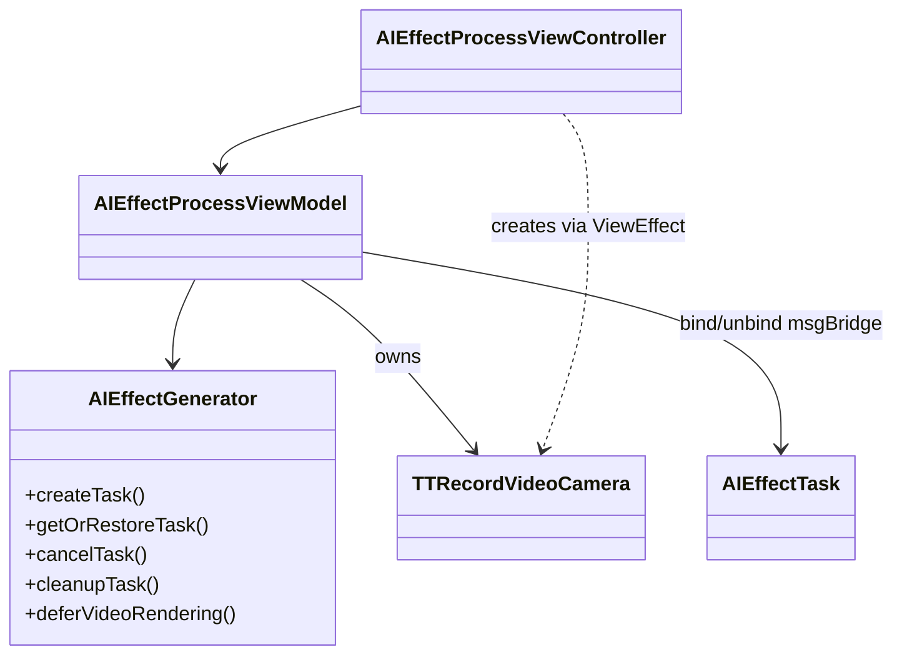

# 技术调研报告 v1.0

> **说明**：这是一个完整填充的 tech_survey.md 样例（基于 AI Effect Camera 架构迁移场景），供 AI 生成时参照格式和质量标准。

## 1. 需求概要

### 1.1 项目背景与目标
AI 特效处理流程中，camera 当前由 `AIEffectGenerator` 创建/持有/销毁，与生成器职责耦合严重。需迁移为由 Process VC（含其 VM）独立负责 camera 的创建、持有、使用与销毁，降低后台化后的耦合复杂度，并消除多任务场景下的泄漏风险。

### 1.2 核心功能清单
| 编号 | 功能名称 | 描述 | 优先级 |
|:-----|:---------|:-----|:-------|
| F-01 | Camera Owner 迁移 | 将 camera 的创建/持有/销毁从 AIEffectGenerator 迁移到 Process VC+VM | P0 |
| F-02 | Preview 容器新建 | Process VC 新增 previewContainerView/previewMaskView 承载相机预览 | P0 |
| F-03 | Bridge 绑定迁移 | camera 的 msgBridge 绑定与解绑责任从 generator 迁移到 VM | P0 |
| F-04 | 回调分发迁移 | 录制完成/失败回调从 generator.bindCameraCallbacks 迁移到 VM extension | P1 |
| F-05 | 生命周期收敛 | 统一销毁入口为 VM.cleanupCamera(reason:)，消除多处分散销毁 | P0 |

### 1.3 约束条件
- **技术约束**: 后台已切换为 NLE 渲染；最小改动不侵入 workflow/draft/route 域逻辑
- **架构约束**: 不新增独立实体（如 CameraController），用 viewEffect 通道协作
- **兼容约束**: MUST 兼容现有多任务 camera 并发场景

### 1.4 验收标准
| 编号 | 验收项 | 通过条件 |
|:-----|:-------|:---------|
| AC-01 | Camera 创建归属 | camera 由 VC 响应 ViewEffect 创建，AIEffectGenerator 不再持有 cameraService |
| AC-02 | 生命周期唯一入口 | camera 销毁仅通过 VM.cleanupCamera(reason:) 触发，无其他销毁路径 |
| AC-03 | Bridge 时序正确 | idle 状态 setupCamera → 绑定 bridge → renderImage 顺序严格保证 |
| AC-04 | 退后台重建 | 退后台销毁 camera 后重新进入前台，camera 自动重建且预览正常 |
| AC-05 | 多任务隔离 | 并发多个 task 时各自 camera 独立，销毁不交叉 |

### 1.5 非功能性需求
- **性能**: camera 创建到预览首帧 < 500ms
- **稳定性**: 连续 load/retry 10 次不出现 camera 错配或泄漏
- **兼容性**: 支持 iOS 15+

## 2. 需求澄清记录
| 轮次 | 问题 | 用户回答 |
|:-----|:-----|:---------|
| Q1 | 现有 AIEffectCameraService 的 taskCameraMap 迁移后，VM 是直接持有单个 camera 实例还是保留 map 结构？ | 直接持有单个实例，一个 Process 对应一个 camera |
| Q2 | camera 迁移到 Process 侧后，是否需要新增 ProcessCameraController 独立实体来封装相机细节？ | 不需要，用 viewEffect 通道协作即可，不新增实体 |
| Q3 | Preview 容器是复用现有的 backgroundImageView 还是新建？ | 新建 previewContainerView，语义更清晰 |

## 3. 审查摘要 (Quality Assurance)
- 💡 **PM 确认**: "camera 迁移到 Process VC"本质是"资源 owner 下移 + 去单例依赖"，能显著降低生成后台化后的耦合复杂度，并降低多任务场景下的泄漏风险。
- 🛡️ **架构师修正**:
    - 不能只"把 new camera 的代码搬家"：当前 camera 还是 task 的 `msgBridge`，迁移必须同时重构"bridge 绑定与解绑"责任边界。
    - 建议 VC 作为唯一 Owner，但把相机细节封装成 `ProcessCameraController/Session` 由 VC 强持有。→ 最终反馈：不新增实体，用 viewEffect 通道协作。
- 🚨 **规范合规**: 现状中 camera 生命周期入口分散（VM deinit / moveToBackground / cleanupTask / generator cleanupTask），迁移必须明确"唯一销毁来源"。

## 4. 选型对比表 (Technology Comparison)

> 本项目为架构迁移类，无外部技术选型。以下对比 camera owner 的内部方案。

| 方案 | 描述 | VM 是否触达 UIKit | 新增实体 | 生命周期清晰度 | 结论 |
|:-----|:-----|:----------------|:---------|:-------------|:-----|
| 方案 A: VC 创建 camera，回传给 VM 持有 | VC 通过 ViewEffect 收到请求后创建 camera，回传给 VM | 否 | 无 | 高 | ✅ 推荐 |
| 方案 B: VM 直接创建 camera | VM 内部调用 TTRecordVideoCamera(cameraView:...) | 是（违反约束） | 无 | 中 | ❌ 排除 |
| 方案 C: 新增 ProcessCameraController | 独立 controller 管理 camera 生命周期 | 否 | 1 个新实体 | 高 | ❌ 排除（YAGNI） |

## 5. 现状映射表 (Context Map)
| PRD 功能点 | 现有代码逻辑/类 | 匹配度 | 备注 |
|:-----------|:---------------|:-------|:-----|
| camera 创建 | `AIEffectGenerator.setupCamera` → `AIEffectCameraService.setupCamera` → `AICameraBuilder.buildCamera` | ⚠️重构 | 目前由 generator 触发创建并绑定 bridge，需要迁移到 Process 侧 |
| camera 持有 | `AIEffectCameraService.taskCameraMap(taskID -> TTRecordVideoCamera)` | ⚠️重构 | 当前 map 由 generator 持有的 service 管理；迁移后由 VM 直接持有 |
| camera 销毁 | `AIEffectCameraService.destroyCamera` → `AICameraBuilder.destroyCamera` | ⚠️重构 | 销毁触发点分散，且依赖"remove map 即释放"的隐式语义 |
| 生成启动触发 | `AIEffectProcessViewModel.prepareCameraForGeneration` + `render cover image` | ⚠️重构 | idle 状态必须先 setupCamera 绑定 bridge，再 renderImage 启动流程 |
| 录制完成/失败分发 | `AIEffectGenerator.bindCameraCallbacks` 把 CameraService 回调分发到 task | ⚠️重构 | generator 不再持有 cameraService，需把"回调分发"迁移到 VM extension |

## 6. 决策记录 (Decision Log)
| 决策点 | 讨论摘要 | 最终选择 | 理由 |
|:-------|:---------|:---------|:-----|
| Camera owner 方案 | 方案A(VC创建+VM持有) vs 方案B(VM直接创建) vs 方案C(新增Controller) | 方案 A | VM 不触达 UIKit；不新增实体；ViewEffect 通道已有先例 |
| Preview 容器方案 | 复用 backgroundImageView vs 新建 previewContainerView | 新建容器 | 语义清晰；避免 background 图层级耦合 |
| Delegate 实现方式 | 独立 adapter vs VM extension conform | VM extension | 不新增实体；代码组织清晰 |

## 7. 方案概要
- **选定方案**: VC 创建 camera + VM 持有（方案 A）
- **核心思路**: VC 通过 ViewEffect 通道响应 VM 的 camera 创建请求，创建后回传给 VM 持有；VM 成为 camera owner 负责 delegate、bridge 绑定和统一销毁
- **YAGNI 删减**: 不新增 ProcessCameraController 实体（方案 C 排除）
- **备选方案**: 方案 B（VM 直接创建）因违反"VM 不触达 UIKit"约束而排除；方案 C（新增 Controller）因 YAGNI 排除

## 8. 详细变更方案 (Detail Plan)

### 8.1 核心类修改

**类名**: `AIEffectGenerator`
- **现状**: 持有 `cameraService` 并暴露 setupCamera/startCapture/stopCapture/renderImage/destroyCamera 薄封装。在 setupCamera 中绑定 task.msgBridge，在 bindCameraCallbacks 中分发回调。
- **修改建议（目标态）**: 删除 `cameraService` 成员及所有 camera 操作 API。仅保留 Task 生命周期 + workflow 绑定 + NLE deferVideoRendering。

**类名**: `AIEffectProcessViewController / AIEffectProcessViewModel`
- **现状**: VM 通过 generator 调用相机，VC 不直接参与 camera 创建。
- **修改建议（目标态）**: VC 新增 previewContainerView/previewMaskView，响应 ViewEffect 创建 camera 并回传。VM 成为 camera owner，实现 delegate，负责 bridge 绑定与销毁收敛。

### 8.2 业务流程
1. 页面进入 → generator.restoreOrCreateTask → Process 侧初始化
2. 新建任务 idle → VM 发出 viewEffect.requestCreateCamera → VC 创建 camera + 设置 preview → 回传给 VM
3. VM provideCamera → 绑定 delegate/bridge → render cover image 启动生成
4. 退后台/退出/重试 → VM.cleanupCamera(reason:) 统一销毁

## 9. 架构建模 (Mermaid)

## 10. 难点预判与风险
| 风险项 | 严重度 | 缓解策略 |
|:-------|:-------|:---------|
| bridge 绑定时序：idle 启动前必须完成绑定 | P0 | provideCamera 中立即绑定，绑定后才触发 render |
| 多次 load/retry 导致旧 camera 错配 | P1 | provideCamera 校验 taskID 一致性，不一致则忽略 |
| 退后台销毁后重新进入需重建 camera | P1 | 进入前台时检测 camera==nil → 重新走 requestCreateCamera |

## 11. 开放问题
| 编号 | 问题 | 影响范围 | 状态 |
|:-----|:-----|:---------|:-----|
| Q-01 | NLE 渲染模式下 camera 帧率是否需要动态调整 | F-01 Camera Owner 迁移 | 待确认 |
| Q-02 | 多任务并发时 camera 资源竞争的上限策略 | F-05 生命周期收敛 | 待确认 |
