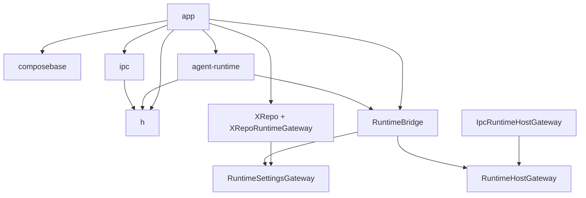

# 技术方案与 API 设计 v1.1

## 1. 架构特征分析
- **强制工具类**: Xposed 侧基础设施复用 `h` 模块；UI 状态管理复用 `ComposeMVIViewModel`；本地设置读写继续复用 `LocalSettingsCodec`、`LocalSettingsStore`、`XService`
- **架构模式**: 当前仓库是“高层装配在 `app`、基础设施在 library module”的渐进式分层；UI 侧采用 Compose + MVI-ish ViewModel；宿主侧采用 Xposed Hook 编排
- **依赖约束**: `composebase` 不允许反向依赖 `app`；`agent-runtime` 不允许依赖 `app`；`app` 可以依赖 `composebase`、`agent-runtime`、`h`、`ipc`
- **迁移约束**: 用户只在 Android Studio 中做机械移动；ASC 负责 Gradle、新模块、导入修正和边界收敛
- **包名策略**: 本轮优先保持已迁移源码的原 package 不变，以降低 AS 迁移成本；模块名与 package 名不强制一致

## 2. 审查发现 (Review Findings)
- **PM 缺口检查**: 如果只创建新模块而不切断 `chat -> XRepo` 依赖，Runtime 迁移会卡在依赖回环，功能无法真正独立
- **架构一致性检查**: `ui/infra` 是被 `ui/nexus` 大量复用的基础层，不应继续留在 `app`；`chat` 是独立运行时，不应与 `app` 的仓储实现耦合
- **设计隔离检查**:
  - `composebase/ui/infra`: What=通用 Compose Shell 与交互基建 | How=由业务页面直接 import 使用 | Depends=[Compose, Material3, Backdrop, Haze, Lifecycle] → ✅
  - `agent-runtime`: What=LLM 会话、工具、MCP、流式事件运行时 | How=由 `LLMController` 和内建管理器对外暴露能力 | Depends=[h, s3ss10n, OkHttp, RuntimeSettingsGateway] → ✅
  - `app/repo`: What=本地配置持久化与 App 侧设置门面 | How=通过 `XRepo`、`LocalSettingsCodec` 对 UI 和宿主层提供读写 | Depends=[XService, LocalSettingsStore, agent-runtime shared models] → ✅
  - `app/mod`: What=宿主 Hook、入口与配置加载门面 | How=通过 `Entrance`、`AbstractAssistantHook`、`XService` 编排 | Depends=[h, ipc, agent-runtime] → ✅

## 3. 设计决策记录
| 争议点 | 讨论摘要 | 最终选择 | 理由 |
|:-------|:---------|:---------|:-----|
| 迁移后的 package 是否统一改名 | 方案 A：跨模块迁移先保留原 package；方案 B：迁移同时重命名到新 package | 方案 A | 可把用户在 AS 的工作压缩为“Move”，避免把包重命名和模块迁移耦合在一起 |
| `LLMController -> XRepo` 环如何切断 | 方案 A：引入 `RuntimeSettingsGateway` 由 `app` 提供实现；方案 B：把 `repo` 一并迁入 runtime | 方案 A | 本轮约束已明确 `repo` 不拆出 `app`，因此只能让 runtime 依赖接口而不是依赖实现 |
| 共享配置模型放哪里 | 方案 A：迁入 `agent-runtime` 的 shared settings 包；方案 B：继续放在 `app/repo` 并让 runtime 引用 | 方案 A | 共享 DTO 必须位于低层，才能同时被 runtime 和 app/repo 使用且不形成回环 |
| runtime 如何承接未来宿主能力 | 方案 A：继续按能力新增若干独立 gateway 挂到 `RuntimeEnvironment`；方案 B：新增统一 `RuntimeBridge`，在 bridge 下分组 `settings` / `host` 能力 | 方案 B | 配置读取与宿主能力都属于 runtime 对外部世界的依赖，应通过统一安装点装配，避免 runtime 继续直接依赖 `ipc` 或未来出现多个平行全局 gateway |

## 4. 方案概览
本轮采用“模块先切、包名后稳、边界同步收敛”的设计：
- **UI Infra 下沉**: 将 `app/ui/infra/**` 迁入 `composebase`，保留原 package `com.niki914.nexus.agentic.app.ui.infra`
- **Runtime 独立**: 新建 `agent-runtime` Android library 模块，承接 `app/chat/**`，本轮保留原 package `com.niki914.nexus.agentic.chat`
- **共享模型下沉**: 将 `LlmConfig`、`McpServer`、`McpTool`、`CustomTool`、`BuiltinToolSetting`、`CustomToolValidation` 下沉到 `agent-runtime` 的 shared settings 包
- **接口切环**: 在 `agent-runtime` 中定义 `RuntimeBridge` 统一安装入口，其中 `settings` 由 `RuntimeSettingsGateway` 抽象，`host` 由 `RuntimeHostGateway` 抽象；`app` 侧分别提供 `XRepoRuntimeGateway` 与 `IpcRuntimeHostGateway`
- **执行分工**: 你在 AS 执行 Move；ASC 负责新模块、Gradle、包外引用修正、接口注入和边界重构

## 5. 项目目录结构
```text
nexus/
├── app/
│   ├── build.gradle.kts
│   └── src/main/java/
│       ├── a0/a0/a0/a0/a0/a0/
│       │   └── Entrance.kt
│       └── com/niki914/nexus/agentic/
│           ├── app/
│           │   ├── App.kt
│           │   ├── MainActivity.kt
│           │   └── ui/
│           │       └── nexus/
│           │           ├── NexusApp.kt
│           │           ├── NexusPages.kt
│           │           ├── content/
│           │           ├── model/
│           │           └── nav/
│           ├── mod/
│           │   ├── HookLocalSettings.kt
│           │   ├── SettingModels.kt
│           │   ├── XService.kt
│           │   └── feat/
│           └── repo/
│               ├── LocalSettingsCodec.kt
│               ├── LocalSettingsStore.kt
│               ├── XRepo.kt
│               ├── XRepoRuntimeGateway.kt
│               └── XServiceLocalSettingsStore.kt
├── composebase/
│   ├── build.gradle.kts
│   └── src/main/java/
│       ├── com/niki914/nexus/cb/
│       │   ├── BaseTheme.kt
│       │   ├── ComposeMVIViewModel.kt
│       │   └── theme/
│       └── com/niki914/nexus/agentic/app/ui/infra/
│           ├── ActionBarButton.kt
│           ├── LiquidScreen.kt
│           ├── LiquidScreenState.kt
│           ├── LiquidScreenSwipeContent.kt
│           ├── LiquidViewportAvoidance.kt
│           ├── component/
│           ├── interaction/
│           ├── nav/
│           ├── preview/
│           └── shape/
├── agent-runtime/
│   ├── build.gradle.kts
│   └── src/main/java/
│       ├── com/niki914/nexus/agentic/chat/
│       │   ├── LLMController.kt
│       │   ├── ConversationJournal.kt
│       │   ├── ConversationTurnState.kt
│       │   ├── LlmModels.kt
│       │   ├── LlmStreamEvent.kt
│       │   └── agentic/
│       │       ├── buildin/
│       │       ├── custom/
│       │       ├── mcp/
│       │       ├── shell/
│       │       └── stream/
│       └── com/niki914/nexus/agentic/runtime/settings/
│           ├── RuntimeSettingsGateway.kt
│           ├── RuntimeEnvironment.kt
│           └── model/
│               └── RuntimeSettingsModels.kt
├── h/
└── ipc/
```

## 6. 详细 API 设计

### Interface: `RuntimeSettingsGateway`
- **类型**: 新增
- **职责**: 为 `agent-runtime` 提供读取/写入运行时配置的抽象接口，隔离 runtime 对 `app/repo` 实现的直接依赖
- **隔离验证**: What=运行时配置访问抽象 | How=由 app 提供实现并在启动时安装 | Depends=[RuntimeSettingsModels]  

#### 方法（完整签名）
- `suspend fun readLlmConfig(): RuntimeLlmConfig`
- `suspend fun listMcpServers(): List<RuntimeMcpServer>`
- `suspend fun listCachedTools(server: RuntimeMcpServer): List<RuntimeMcpTool>`
- `suspend fun saveDiscoveredTools(url: String, headers: Map<String, String>, tools: List<RuntimeMcpTool>)`
- `suspend fun clearMcpCacheByServerNames(names: Set<String>)`
- `suspend fun fingerprintMcpServers(): String`
- `suspend fun listCustomTools(): List<RuntimeCustomTool>`
- `suspend fun saveCustomTool(tool: RuntimeCustomTool, overwrite: Boolean = true): RuntimeCustomToolValidation?`
- `suspend fun replaceAllCustomTools(tools: List<RuntimeCustomTool>): RuntimeCustomToolValidation?`
- `suspend fun deleteCustomTool(name: String)`
- `suspend fun setCustomToolEnabled(name: String, enabled: Boolean)`
- `suspend fun listBuiltinToolSettings(): List<RuntimeBuiltinToolSetting>`
- `suspend fun setBuiltinToolEnabled(name: String, enabled: Boolean): RuntimeCustomToolValidation?`

---

### Interface: `RuntimeHostGateway`
- **类型**: 新增
- **职责**: 为 `agent-runtime` 提供宿主能力抽象，避免 builtin/tool 直接依赖 `ipc`、`XService` 或其他宿主实现
- **隔离验证**: What=宿主能力访问抽象 | How=由 app 提供实现并在启动时安装 | Depends=[Kotlin interface]

#### 方法（完整签名）
- `suspend fun postNotification(title: String, content: String, uri: String?): Boolean`

---

### Class: `RuntimeBridge`
- **类型**: 新增
- **职责**: 聚合 runtime 所需的外部依赖分组，作为 `RuntimeEnvironment` 的唯一安装单元
- **隔离验证**: What=runtime 外部依赖聚合桥 | How=app 在启动/Hook 初始化时整体安装，再由 runtime 侧按能力读取 | Depends=[RuntimeSettingsGateway, RuntimeHostGateway]

#### 属性 / 方法（完整签名）
- `data class RuntimeBridge(val settings: RuntimeSettingsGateway, val host: RuntimeHostGateway)`

---

### Class: `RuntimeEnvironment`
- **类型**: 新增
- **职责**: 保存 `agent-runtime` 的全局依赖安装点，向 runtime 代码暴露统一 bridge
- **隔离验证**: What=运行时依赖安装器 | How=App/Entrance 启动时调用 install，再由 runtime 代码读取 bridge 或其子能力 | Depends=[RuntimeBridge]

#### 属性 / 方法（完整签名）
- `@Volatile private var bridge: RuntimeBridge? = null`
- `fun install(bridge: RuntimeBridge): Unit`
- `fun requireBridge(): RuntimeBridge`
- `suspend fun awaitBridge(): RuntimeBridge`
- `fun requireSettingsGateway(): RuntimeSettingsGateway`
- `suspend fun awaitSettingsGateway(): RuntimeSettingsGateway`
- `fun clearForTest(): Unit`

---

### Class: `RuntimeSettingsModels`
- **类型**: 新增
- **职责**: 定义 `agent-runtime` 与 `app/repo` 共用的配置 DTO，替代当前位于 `XRepoModels.kt` 中、只能被 `app` 拥有的模型
- **隔离验证**: What=共享配置模型 | How=由 runtime 和 app/repo 双方 import 使用 | Depends=[Kotlin data classes]

#### 数据模型（完整签名）
- `data class RuntimeLlmConfig(val provider: String = "", val endpoint: String = "", val apiKey: String = "", val model: String = "", val prompt: String = "", val proxy: String = "", val memoryPrompt: String = "", val takeoverKeywords: List<String> = emptyList())`
- `data class RuntimeMcpServer(val name: String, val url: String, val enabled: Boolean = true, val headers: Map<String, String> = emptyMap())`
- `data class RuntimeMcpTool(val name: String, val description: String = "", val inputSchemaJson: String)`
- `data class RuntimeCustomTool(val name: String, val description: String, val command: String, val enabled: Boolean = true)`
- `data class RuntimeBuiltinToolSetting(val name: String, val description: String, val enabled: Boolean)`
- `data class RuntimeCustomToolValidation(val field: String, val message: String)`

---

### Class: `LLMController`
- **类型**: 修改
- **职责**: 保持 LLM runtime 门面职责不变，但不再直接访问 `XRepo`
- **隔离验证**: What=LLM 会话与工具编排 | How=对外暴露 `refresh()`、`stream()`、`resetConversation()` | Depends=[RuntimeEnvironment, ToolManager, s3ss10n, h]

#### 修改要点
- 将 `import com.niki914.nexus.agentic.repo.XRepo` 替换为 `import com.niki914.nexus.agentic.runtime.settings.RuntimeEnvironment`
- 将 `import com.niki914.nexus.agentic.repo.LlmConfig` 替换为 `import com.niki914.nexus.agentic.runtime.settings.model.RuntimeLlmConfig`
- 在 `refresh()` 中统一通过 `val gateway = RuntimeEnvironment.awaitSettingsGateway()` 读取 llm/mcp/custom/builtin 配置

#### 关键方法（完整签名）
- `suspend fun refresh(): LlmRuntimeSnapshot`
- `suspend fun refreshFromHookContext(): LlmRuntimeSnapshot`
- `suspend fun snapshot(): LlmRuntimeSnapshot?`
- `fun stream(query: String): Flow<LlmStreamEvent>`
- `suspend fun resetConversation(): Unit`

---

### Class: `BuiltinToolSettingsManager`
- **类型**: 修改
- **职责**: 继续负责 builtin tool 设置的加载与切换，但通过 gateway 而不是 `XRepo`
- **隔离验证**: What=builtin tool 设置门面 | How=load/setEnabled | Depends=[RuntimeEnvironment, RuntimeBuiltinToolSetting]

#### 关键方法（完整签名）
- `suspend fun load(): List<BuiltinToolSettingItem>`
- `suspend fun setEnabled(name: String, enabled: Boolean): BuiltinToolResult`

#### 修改要点
- `load(): List<BuiltinToolSettingItem>` 的实现改为读取 `RuntimeEnvironment.awaitSettingsGateway().listBuiltinToolSettings()`
- `setEnabled(name: String, enabled: Boolean): BuiltinToolResult` 的实现改为读取 `RuntimeEnvironment.awaitSettingsGateway().setBuiltinToolEnabled(name, enabled)`

---

### Class: `CustomToolManager`
- **类型**: 修改
- **职责**: 继续负责自定义工具校验与保存，但不再依赖 `XRepo`
- **隔离验证**: What=自定义工具管理 | How=load/createOrUpdate/saveAll/delete/setEnabled | Depends=[RuntimeEnvironment, BuiltinToolRegistry, ShellCommandSafetyPolicy]

#### 关键方法（完整签名）
- `suspend fun load(): List<CustomToolConfig>`
- `suspend fun createOrUpdate(request: CustomToolCreateRequest): BuiltinToolResult`
- `suspend fun saveAll(items: List<CustomToolConfig>): BuiltinToolResult`
- `suspend fun delete(name: String): BuiltinToolResult`
- `suspend fun setEnabled(name: String, enabled: Boolean): BuiltinToolResult`

#### 修改要点
- 将 `CustomTool` / `CustomToolValidation` 替换为 runtime shared model
- `load(): List<CustomToolConfig>` 与所有写操作的实现统一改为调用 gateway

---

### Class: `McpDiscoveryCacheStore`
- **类型**: 修改
- **职责**: 继续负责 MCP tools 发现缓存，但不再直接持有 `XRepo`
- **隔离验证**: What=MCP 发现结果持久化 | How=onToolsDiscovered 后调用 gateway 保存 | Depends=[RuntimeEnvironment, RuntimeMcpTool, Json]

#### 关键方法（完整签名）
- `suspend fun onToolsDiscovered(url: String, headers: Map<String, String>, responseJson: String): Unit`
- `private suspend fun persistDiscoveredTools(url: String, headers: Map<String, String>, tools: List<McpCachedTool>): Unit`

---

### Class: `NotifyBuiltin`
- **类型**: 修改
- **职责**: 继续提供通知 builtin，但通过 `RuntimeHostGateway` 访问宿主通知能力，不再直接依赖 `ipc`
- **隔离验证**: What=通知 builtin | How=invoke 时从 `RuntimeEnvironment.awaitBridge().host` 调用 `postNotification()` | Depends=[RuntimeEnvironment, RuntimeHostGateway]

#### 关键方法（完整签名）
- `override suspend fun invoke(request: BuiltinToolRequest): BuiltinToolResult`

#### 修改要点
- 删除对 `ContextProvider`、`XIpcBridge`、`XService` 的直接 import
- 将通知发送实现替换为 `RuntimeEnvironment.awaitBridge().host.postNotification(title, content, uri)`

---

### Class: `XRepoRuntimeGateway`
- **类型**: 新增
- **职责**: 位于 `app/repo`，把现有 `XRepo` 适配到 `RuntimeSettingsGateway`
- **隔离验证**: What=app 对 runtime 的配置适配器 | How=实现 RuntimeSettingsGateway 并映射 DTO | Depends=[XRepo, RuntimeSettingsGateway, RuntimeSettingsModels]

#### 关键方法（完整签名）
- `class XRepoRuntimeGateway(private val repo: XRepo = XRepo) : RuntimeSettingsGateway`
- `override suspend fun readLlmConfig(): RuntimeLlmConfig`
- `override suspend fun listMcpServers(): List<RuntimeMcpServer>`
- `override suspend fun listCachedTools(server: RuntimeMcpServer): List<RuntimeMcpTool>`
- `override suspend fun saveDiscoveredTools(url: String, headers: Map<String, String>, tools: List<RuntimeMcpTool>): Unit`
- `override suspend fun clearMcpCacheByServerNames(names: Set<String>): Unit`
- `override suspend fun fingerprintMcpServers(): String`
- `override suspend fun listCustomTools(): List<RuntimeCustomTool>`
- `override suspend fun saveCustomTool(tool: RuntimeCustomTool, overwrite: Boolean): RuntimeCustomToolValidation?`
- `override suspend fun replaceAllCustomTools(tools: List<RuntimeCustomTool>): RuntimeCustomToolValidation?`
- `override suspend fun deleteCustomTool(name: String): Unit`
- `override suspend fun setCustomToolEnabled(name: String, enabled: Boolean): Unit`
- `override suspend fun listBuiltinToolSettings(): List<RuntimeBuiltinToolSetting>`
- `override suspend fun setBuiltinToolEnabled(name: String, enabled: Boolean): RuntimeCustomToolValidation?`

---

### Class: `XRepo`
- **类型**: 修改
- **职责**: 继续作为 App 侧设置门面，但其共享模型与 runtime 注册表依赖位置发生变化
- **隔离验证**: What=本地设置读写门面 | How=保持 `llm()`、`customTools.*`、`builtinTools.*`、`mcp.*` API | Depends=[LocalSettingsCodec, LocalSettingsStore, RuntimeSettingsModels, BuiltinToolRegistry]

#### 修改要点
- `XRepoModels.kt` 删除，所有模型 import 改为 `com.niki914.nexus.agentic.runtime.settings.model.*`
- 保留 `BuiltinToolRegistry`、`ShellCommandSafetyPolicy` 的使用；因为 `app` 依赖 `agent-runtime`，此方向允许存在
- `XRepo` 的外部公开方法签名保持不变，仅参数/返回类型切换到 runtime shared model

---

### Class: `App`
- **类型**: 修改
- **职责**: 在主进程启动时完成 runtime bridge 安装
- **隔离验证**: What=应用初始化 | How=onCreate 中 install runtime bridge | Depends=[RuntimeEnvironment, RuntimeBridge, XRepoRuntimeGateway, IpcRuntimeHostGateway, XService]

#### 关键方法（完整签名）
- `override fun onCreate(): Unit`

#### 修改要点
- 在 `onCreate()` 顶部增加 `RuntimeEnvironment.install(createAppRuntimeBridge())`

---

### Class: `Entrance`
- **类型**: 修改
- **职责**: 在宿主进程初始化时完成 `XRepo.init()` 后的 runtime bridge 安装，确保 Hook 环境下 `LLMController` 与 host builtin 可用
- **隔离验证**: What=Xposed 入口装配 | How=onLoad 初始化 context 后安装 bridge | Depends=[XRepo, RuntimeEnvironment, RuntimeBridge, XRepoRuntimeGateway, IpcRuntimeHostGateway, h]

#### 关键方法（完整签名）
- `override fun onLoad(params: XC_LoadPackage.LoadPackageParam): Unit`

#### 修改要点
- 在 `XRepo.init(ctx)` 之后增加 `RuntimeEnvironment.install(createAppRuntimeBridge())`

---

### Class: `IpcRuntimeHostGateway`
- **类型**: 新增
- **职责**: 位于 `app`，把宿主通知等 IPC 能力适配成 `RuntimeHostGateway`
- **隔离验证**: What=宿主能力到 runtime host gateway 的适配器 | How=内部调用 `ContextProvider` / `XIpcBridge`，对 runtime 暴露纯接口 | Depends=[RuntimeHostGateway, ContextProvider, XIpcBridge]

#### 关键方法（完整签名）
- `class IpcRuntimeHostGateway : RuntimeHostGateway`
- `override suspend fun postNotification(title: String, content: String, uri: String?): Boolean`

---

### File: `AppRuntimeBridge.kt`
- **类型**: 新增
- **职责**: 集中组装 `RuntimeBridge(settings = XRepoRuntimeGateway(), host = IpcRuntimeHostGateway())`，避免 `App` 与 `Entrance` 重复装配逻辑
- **隔离验证**: What=runtime bridge 组装器 | How=暴露工厂函数返回完整 `RuntimeBridge` | Depends=[RuntimeBridge, XRepoRuntimeGateway, IpcRuntimeHostGateway]

#### 关键方法（完整签名）
- `fun createAppRuntimeBridge(): RuntimeBridge`

## 7. 数据模型 / Gradle 设计

### 7.1 `settings.gradle.kts`
- 新增 `include(":agent-runtime")`

### 7.2 `agent-runtime/build.gradle.kts`
- `plugins`
  - `id("com.android.library") version "8.11.0"`
  - `id("org.jetbrains.kotlin.android") version "2.2.0"`
  - `id("org.jetbrains.kotlin.plugin.serialization") version "2.2.0"`
- `android.namespace`
  - `com.niki914.nexus.agentic.runtime`
- `dependencies`
  - `implementation(project(":h"))`
  - `implementation("com.github.niki914:s3ss10n:2.0.2")`
  - `implementation("com.squareup.okhttp3:okhttp:4.12.0")`
  - `implementation("org.jetbrains.kotlinx:kotlinx-serialization-json:1.6.3")`
  - `implementation("org.jetbrains.kotlinx:kotlinx-coroutines-core:1.10.2")`
- 不再允许 `agent-runtime` 直接依赖 `:ipc`

### 7.3 `composebase/build.gradle.kts`
- 保留现有 Compose / Navigation 依赖
- 新增第三方 UI 依赖
  - `implementation("com.github.Kyant0:Capsule:2.1.0")`
  - `implementation("io.github.kyant0:backdrop:2.0.0-alpha03")`
  - `implementation("dev.chrisbanes.haze:haze:1.7.2")`
  - `implementation("androidx.lifecycle:lifecycle-viewmodel-compose:2.8.7")`
- 不新增对 `app` 的任何依赖

### 7.4 `app/build.gradle.kts`
- 新增 `implementation(project(":agent-runtime"))`
- 保留 `implementation(project(":composebase"))`
- 保留 `implementation(project(":h"))`
- 保留 `implementation(project(":ipc"))`
- 删除应迁入 `agent-runtime` 的 runtime 依赖
  - `com.github.niki914:s3ss10n:2.0.2`
  - `com.squareup.okhttp3:okhttp:4.12.0`
  - `org.jetbrains.kotlinx:kotlinx-serialization-json:1.6.3`
- 删除仅由 `ui/infra` 使用且 `ui/nexus` 不直接使用的 UI 依赖时，以实际导入结果为准；`haze` 在 `ui/nexus` 仍被直接使用，因此 `app` 与 `composebase` 都需要保留该依赖

## 8. 架构图 (Mermaid)

