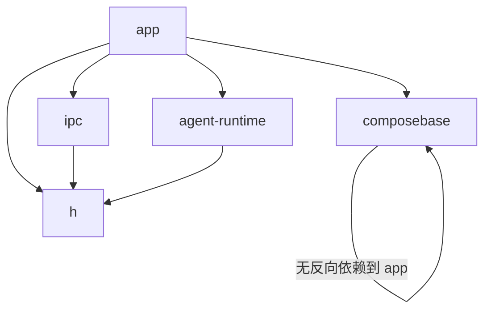

# 技术调研报告 v1.0

## 1. 需求概要

### 1.1 项目背景与目标
当前仓库中 `app` 模块同时承载 Xposed 入口、宿主 Hook、LLM Runtime、配置仓储、Compose UI Shell，职责明显过宽，代码体量远高于其他模块。目标是在保持当前功能边界基本不变的前提下，完成一轮最小可落地的模块重构：把通用 UI Infra 下沉到 `composebase`，并把 `chat` 相关 Runtime 迁入新模块 `agent-runtime`，同时明确 AS 机械迁移与 ASC 自动化改造的职责分工。

### 1.2 核心功能清单
| 编号 | 功能名称 | 描述 | 优先级 |
|:-----|:---------|:-----|:-------|
| F-01 | UI Infra 下沉 | 将 `app/ui/infra` 迁入 `composebase`，保留业务页面 `app/ui/nexus` 在 `app` | P0 |
| F-02 | Runtime 模块新建 | 新建 `agent-runtime` 模块，承接 `app/chat` 及其子目录代码 | P0 |
| F-03 | 依赖边界收敛 | 调整 `app`、`composebase`、`agent-runtime` 的 Gradle 依赖与导入路径 | P0 |
| F-04 | 仓储反向依赖解耦 | 收敛 `XRepo` 对 runtime 细节的直接依赖，避免迁移后出现 `app -> runtime -> app` 环 | P0 |
| F-05 | 迁移职责分工 | 明确 AS 负责包/目录移动，ASC 负责新模块创建、依赖声明、非机械式边界修正 | P1 |

### 1.3 约束条件
- **技术约束**: 保持现有 Kotlin/Android/Gradle 体系，不引入新的架构框架
- **架构约束**: 本轮只做“两刀方案”，不继续拆 `repo` 为独立模块，不拆分 Breeno/XiaoAi 宿主模块
- **执行约束**: 包移动、目录移动、rename 等机械迁移由用户在 Android Studio 完成；新模块创建、Gradle 配置、依赖导入、边界修正由 ASC 流程执行
- **安全约束**: 不改变 Xposed 入口、宿主匹配逻辑和 IPC 协议语义

### 1.4 验收标准
| 编号 | 验收项 | 通过条件 |
|:-----|:-------|:---------|
| AC-01 | UI Infra 迁移完成 | `app/ui/infra/**` 不再留在 `app`，对应代码位于 `composebase` 且 `app/ui/nexus` 正常依赖新位置 |
| AC-02 | Runtime 模块独立 | `agent-runtime` 模块存在，`LLMController` 与 `chat/**` 代码从 `app` 迁出并由 `app`/宿主 Hook 依赖 |
| AC-03 | 依赖方向闭合 | 不存在 `app -> agent-runtime -> app` 或 `composebase -> app` 的依赖回环 |
| AC-04 | Xposed 入口保持稳定 | `Entrance`、宿主 Hook、`XService`、IPC 相关入口仍留在 `app` 或其既有模块，调用语义不变 |
| AC-05 | 迁移职责清晰 | Phase 2/3 任务中能明确区分“需用户在 AS 执行”的机械迁移步骤与“由 ASC 直接改代码/配置”的步骤 |

### 1.5 非功能性需求
- **可维护性**: `app` 仅保留应用壳、业务页面、宿主 Hook、配置门面等高层装配职责
- **可演进性**: 为后续按需继续拆 `repo` / config-domain 预留清晰边界，但本轮不提前实现
- **风险控制**: 优先做低风险可验证的两刀迁移，避免一次性多模块大爆炸

## 2. 需求澄清记录
| 轮次 | 问题 | 用户回答 |
|:-----|:-----|:---------|
| Q1 | 这轮模块重构做到哪一层？ | 采用“两刀方案”：下沉 `app/ui/infra` 到 `composebase`，新建 `agent-runtime` 承接 `chat`，`repo/mod` 先留在 `app` |

## 3. 审查摘要 (Quality Assurance)
- 💡 **PM 确认**: 用户目标不是追求最彻底模块化，而是先把 `app` 从“总装车间”降到“应用壳 + 高层编排”，并保留足够低的迁移成本，符合渐进式重构目标。
- 🛡️ **架构师修正**: 不应把 `app` 内代码简单塞进现有 `h` 或 `ipc`；`ui/infra` 适合下沉到 `composebase`，`chat` 适合形成独立 runtime 模块，而 `repo` 当前因反向依赖问题需先做边界修正后再迁。
- 🚨 **规范合规**: 方案遵循最小改动原则，不新增与当前需求不匹配的中间控制层，不提前拆分宿主模块，避免 YAGNI 型重构膨胀。

## 4. 选型对比表 (Technology Comparison)
| 技术方案 | 成熟度 | 社区活跃度 | 性能表现 | 学习曲线 | 结论 |
|:---------|:-------|:----------|:---------|:---------|:-----|
| 方案 A：两刀方案 | 高 | 高 | 高 | 低 | ✅ 推荐 |
| 方案 B：仅做 UI 下沉 | 高 | 高 | 高 | 很低 | ❌ 收益不足，未解决 runtime 聚集问题 |
| 方案 C：三刀及以上激进拆分 | 中 | 高 | 中 | 高 | ❌ 风险过高，本轮排除 |

## 5. 现状映射表 (Context Map)
| PRD 功能点 | 现有代码逻辑/类 | 匹配度 | 备注 |
|:-----------|:---------------|:-------|:-----|
| 通用 Compose 壳层 | `app/ui/infra/*`、`LiquidScreen`、`NavigationController` | ⚠️重构 | 适合整体迁入 `composebase`，作为 UI 基建层 |
| 业务页面与状态 | `app/ui/nexus/*`、`HomeChatViewModel` 等 | ✅复用 | 继续保留在 `app`，依赖新的 infra/runtime 位置 |
| LLM Runtime | `chat/LLMController`、`chat/agentic/*`、`chat/agentic/mcp/*` | ✨新增 | 需以新模块 `agent-runtime` 承接 |
| 宿主 Hook 编排 | `mod/feat/*`、`Entrance.kt` | ✅复用 | 保留在 `app`，但改为依赖 `agent-runtime` |
| 本地设置仓储 | `repo/XRepo`、`LocalSettingsCodec`、`LocalSettingsStore` | ⚠️重构 | 本轮不独立成模块，但需消除其对 runtime 细节的直接依赖 |

## 6. 决策记录 (Decision Log)
| 决策点 | 讨论摘要 | 最终选择 | 理由 |
|:-------|:---------|:---------|:-----|
| 本轮拆分范围 | 两刀方案 vs 仅 UI 下沉 vs 激进多刀 | 两刀方案 | 兼顾收益、风险和执行成本 |
| UI Infra 去向 | 留在 `app` vs 迁入 `composebase` | 迁入 `composebase` | `composebase` 已是 UI 基建承载点，依赖方向自然 |
| Runtime 去向 | 继续留在 `app` vs 新建 `agent-runtime` | 新建 `agent-runtime` | `chat` 已形成独立子系统，适合模块化 |
| 用户/ASC 分工 | 全部手动迁移 vs 全部自动迁移 vs 混合模式 | 混合模式 | AS 更适合机械移动，ASC 更适合边界修正和 Gradle 操作 |

## 7. 方案概要
- **选定方案**: 两刀方案
- **核心思路**: 用户在 Android Studio 中执行 `app/ui/infra` 和 `app/chat` 的机械移动；ASC 负责新增 `agent-runtime` 模块、修改 Gradle 依赖、处理导入与包名变更带来的非机械边界修正，并在迁移过程中逐步收敛 `XRepo` 的反向依赖。
- **YAGNI 删减**: 本轮不拆 `repo` 为独立模块；不拆 Breeno/XiaoAi 宿主模块；不重写现有导航/主题体系
- **备选方案**: 仅做 UI 下沉的方案改动更小，但无法解决 runtime 与 `app` 的长期聚集；激进多刀方案虽更“完整”，但以当前代码边界会显著提高迁移成本和回归风险

## 8. 详细变更方案 (Detail Plan)

### 8.1 核心类修改
- **`composebase` 模块**
  - 新增承载 `ui/infra` 的目录与命名空间别名策略
  - 接管 `LiquidScreen`、导航控制器、通用 Liquid 组件、交互/形状等基础设施
- **`agent-runtime` 模块**
  - 新建 Android library 模块
  - 接管 `LLMController`、会话状态、Prompt/Tool/MCP/Stream 相关代码
- **`app` 模块**
  - 保留 `Entrance`、`mod`、`repo`、`app/ui/nexus`
  - 调整对 `composebase` 与 `agent-runtime` 的依赖
  - 修正业务页面、宿主 Hook 到新模块的 import
- **`XRepo` / runtime 边界**
  - 抽离 runtime 不应倒灌到仓储层的注册表/策略依赖
  - 保证最终依赖方向为 `app -> agent-runtime`，而不是 runtime 反向依赖 `app`

### 8.2 业务流程
1. 先由 ASC 创建 `agent-runtime` 模块并补齐 Gradle 基础依赖
2. 用户在 AS 中将 `app/ui/infra/**` 移到 `composebase`
3. ASC 修正 `composebase`/`app` 的依赖导入与命名空间问题
4. 用户在 AS 中将 `app/chat/**` 移到 `agent-runtime`
5. ASC 修正 `agent-runtime` 依赖、处理 `XRepo` 边界问题、补齐 `app` 与宿主 Hook 的引用
6. 最终做一次全局 Review，确认没有依赖回环和职责回退

## 9. 架构建模 (Mermaid)

## 10. 难点预判与风险
| 风险项 | 严重度 | 缓解策略 |
|:-------|:-------|:---------|
| `XRepo` 反向依赖 runtime 细节，导致 `agent-runtime` 无法独立 | 高 | 在 Runtime 迁移前先把注册表/策略依赖收敛到合适层级 |
| AS 迁移后包名和 import 大量漂移 | 中 | 由用户只做机械移动，ASC 紧随其后修正 Gradle 和跨模块引用 |
| `composebase` 引入过多业务依赖，导致下沉失败 | 中 | 只迁 `ui/infra`，禁止把 `ui/nexus` 页面和业务状态一起下沉 |
| 宿主 Hook 对 runtime 的调用链断裂 | 高 | 在 Phase 1/2 设计与计划中明确 `mod/feat` 到 `agent-runtime` 的引用调整点 |

## 11. 开放问题
| 编号 | 问题 | 影响范围 | 状态 |
|:-----|:-----|:---------|:-----|
| Q-01 | `XRepo` 中 builtin/shell 相关能力最终是下沉到 runtime，还是上提为共享接口层 | F-02 / F-04 | 待确认 |
| Q-02 | `composebase` 是否需要同步调整 namespace 或继续维持 `com.niki914.nexus.cb` 与迁入代码并存 | F-01 | 待确认 |
