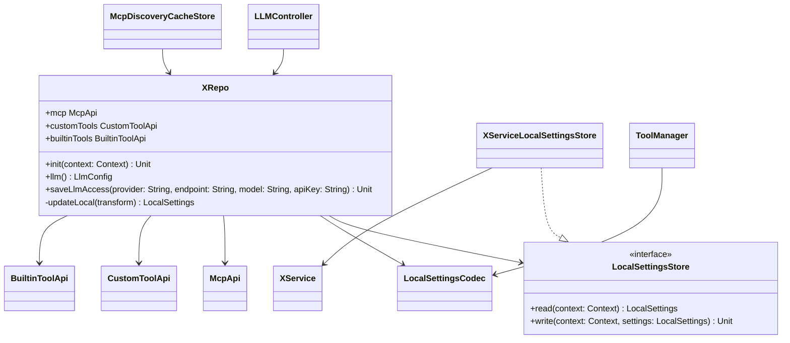

# 技术方案与 API 设计 v1.0

## 1. 架构特征分析
- **强制工具类**: 本地配置底层继续复用 `XService.getLocalSettings(context)` 与 `XService.putLocalSettings(context, settings)`；跨进程与文件落盘继续由 `XIpcBridge`、`XIpcStoreRepository`、`ConfigPersistence` 承担。
- **架构模式**: UI 侧已有 MVI ViewModel；runtime 侧以 `LLMController`、`ToolManager`、`SessionToolBinder` 分层；本方案新增 repo 门面，不改 UI 导航或 session 基建。
- **依赖约束**: `XRepo` 位于 `com.niki914.nexus.agentic.repo`；生产路径依赖 `XService` 与 `ContextProvider`；测试路径通过 internal store 注入，避免 JVM 单元测试依赖 Android `Context` 实例。
- **扩展约束**: `XRepo` 本体只承载初始化、底层读写与高频 LLM API；可扩展配置域通过子域对象挂载，例如 `mcp`、`customTools`、`builtinTools`。
- **模型约束**: 对外模型只表达调用方必须理解的业务概念；`LocalSettings`、`JsonObject`、`JsonArray`、`props` 留在 repo 内部 codec。

## 2. 审查发现 (Review Findings)
- **PM 缺口检查**: 需求覆盖 `XRepo` 核心、单元测试、MCP headers/cache、CustomTool/BuiltinTool、Runtime/UI 迁移。`App.kt` 调试 seed 逻辑保留白名单，不影响本阶段目标。
- **架构一致性检查**: 方案保留 `XService` 作为持久化门面，避免改动 IPC provider；新增 internal `LocalSettingsStore` 仅服务测试和解耦，生产默认实现仍调用 `XService`。
- **设计隔离检查**:
  - `XRepo`: What=统一强类型配置入口 | How=`init` + `llm/saveLlmAccess` + 子域 API | Depends=[ContextProvider, LocalSettingsStore, Mutex] → 通过
  - `LocalSettingsCodec`: What=LocalSettings 与强类型模型互转 | How=纯函数 parse/build | Depends=[kotlinx.serialization.json, LocalSettings] → 通过
  - `McpApi`: What=MCP server 与 cache 读写 | How=list/save/cache/fingerprint | Depends=[XRepoCore, LocalSettingsCodec] → 通过
  - `CustomToolApi`: What=CustomTool 配置读写 | How=list/save/delete/setEnabled | Depends=[XRepoCore, ShellCommandSafetyPolicy, BuiltinToolRegistry] → 通过
  - `BuiltinToolApi`: What=Builtin tool flags 读写 | How=list/setEnabled/enabled | Depends=[XRepoCore, BuiltinToolRegistry] → 通过

## 3. 设计决策记录
| 争议点 | 讨论摘要 | 最终选择 | 理由 |
|:-------|:---------|:---------|:-----|
| 底层读写方式 | `XRepo` 直接使用 `XService`，或扩展 `XIpcBridge/provider` 事务 | `XService` + `XRepo` 进程内 `Mutex` | 复用现有跨进程与落盘能力，降低 IPC 边界改动风险 |
| API 组织方式 | 方法平铺到 `XRepo`，或按配置域拆子对象 | 子域 API | 后续配置项增长时保持 `XRepo` 本体稳定 |
| 测试解耦方式 | JVM 测试直接 mock Android `Context`，或 internal store 注入 | internal `LocalSettingsStore` | 不改变生产路径，单元测试能直接验证 read-transform-write |
| `ToolManager.resolve(settings)` 兼容策略 | 立即删除旧 overload，或迁移期保留 | 迁移期保留旧 overload，新增强类型 overload | 降低批次间耦合，后续批次再删除旧路径 |
| `McpDiscoveryCacheStore` 归属 | 整体并入 `XRepo.mcp`，或保留 response 解析 wrapper | 保留 wrapper，持久化改调 `XRepo.mcp` | 保持 HTTP interceptor 边界清晰，repo 不负责解析 MCP JSON-RPC response |

## 4. 方案概览
本方案新增 `XRepo` 作为本地配置的强类型业务门面。生产环境下 `XRepo` 使用 `XServiceLocalSettingsStore` 读写 `LocalSettings`；`XRepo` 内部使用 `Mutex` 包住 read-modify-write；`LocalSettingsCodec` 将落盘 JSON 与 `LlmConfig`、`McpServer`、`McpTool`、`CustomTool`、`BuiltinToolSetting` 互转。

迁移采用兼容式推进：第一批只新增 `XRepo` 与单元测试；第二批接入 MCP/cache；第三批接入 CustomTool/BuiltinTool；第四批接入 `LLMController` 与 UI ViewModel。每批完成后，对应业务不再新增 raw JSON 拼装路径。

## 5. 项目目录结构
```text
app/src/main/java/com/niki914/nexus/agentic/
├── repo/
│   ├── XRepo.kt                         # 新增：统一入口、context init、写锁、store 注入
│   ├── XRepoModels.kt                   # 新增：LlmConfig、McpServer、McpTool、CustomTool、BuiltinToolSetting
│   ├── LocalSettingsCodec.kt            # 新增：internal JSON codec
│   └── LocalSettingsStore.kt            # 新增：internal store 接口与 XService 默认实现
├── chat/
│   ├── LLMController.kt                 # 修改：后续批次改用 XRepo
│   └── agentic/
│       ├── ToolManager.kt               # 修改：新增强类型 resolve overload
│       ├── mcp/McpDiscoveryCacheStore.kt# 修改：持久化改调 XRepo.mcp
│       ├── custom/CustomToolManager.kt  # 修改：持久化改调 XRepo.customTools
│       └── buildin/BuiltinToolSettingsManager.kt # 修改：flags 改调 XRepo.builtinTools
└── app/ui/nexus/                        # 后续批次迁移 ViewModel 调用

app/src/test/java/com/niki914/nexus/agentic/
└── repo/
    ├── XRepoTest.kt                     # 新增：repo read/write 行为
    └── LocalSettingsCodecTest.kt        # 新增：纯 codec 覆盖
```

最小改动集：不修改 `ipc` 模块；不修改 `XService` 对外签名；不修改 `App.kt` 调试 seed；不调整 UI 页面结构。

## 6. 详细 API 设计

### Class: `XRepo`
- **类型**: 新增 object
- **职责**: 统一强类型配置入口；管理 context 初始化、底层 store、写锁和子域 API。
- **隔离验证**: What=配置入口与写锁边界 | How=公开强类型 API 与子域对象 | Depends=[Context, ContextProvider, LocalSettingsStore, Mutex]

#### 属性
- `val mcp: McpApi`
- `val customTools: CustomToolApi`
- `val builtinTools: BuiltinToolApi`
- `private val initDeferred: CompletableDeferred<Context>`
- `private val writeMutex: Mutex`
- `private var store: LocalSettingsStore`

#### 方法
- `fun init(context: Context): Unit`
  - 逻辑: 保存 `context.applicationContext`；重复调用不覆盖已完成的 context。
- `internal fun installStoreForTest(store: LocalSettingsStore): Unit`
  - 逻辑: JVM 测试注入 fake store；生产代码不调用。
- `internal fun resetForTest(): Unit`
  - 逻辑: 清理测试注入和初始化状态；仅测试源码使用。
- `private suspend fun context(): Context`
  - 逻辑: 若已 init 则返回；否则等待 `ContextProvider.await()` 并自动 init。
- `internal suspend fun readLocal(): LocalSettings`
  - 逻辑: `store.read(context())`。
- `internal suspend fun updateLocal(transform: (LocalSettings) -> LocalSettings): LocalSettings`
  - 逻辑: `writeMutex.withLock { val latest = readLocal(); val updated = transform(latest); store.write(context(), updated); updated }`。
- `suspend fun onboardingCompleted(): Boolean`
  - 逻辑: 返回 `readLocal().onboardingCompleted`。
- `suspend fun setOnboardingCompleted(value: Boolean): Unit`
  - 逻辑: 只写 `onboarding_completed`。
- `suspend fun llm(): LlmConfig`
  - 逻辑: 通过 `LocalSettingsCodec.parseLlm(readLocal())` 返回强类型配置。
- `suspend fun saveLlmAccess(provider: String, endpoint: String, model: String, apiKey: String): Unit`
  - 逻辑: 只更新 `provider`、`endpoint`、`model`、`api_key`，不覆盖 prompt/proxy/memory。
- `suspend fun saveLlm(config: LlmConfig): Unit`
  - 逻辑: 更新完整 LLM 相关字段，保留其他配置域。

---

### Interface: `LocalSettingsStore`
- **类型**: 新增 internal interface
- **职责**: 解耦 `XRepo` 与具体持久化实现，生产默认实现调用 `XService`。
- **隔离验证**: What=LocalSettings 读写抽象 | How=read/write | Depends=[Context, LocalSettings]

#### 方法
- `suspend fun read(context: Context): LocalSettings`
- `suspend fun write(context: Context, settings: LocalSettings): Unit`

---

### Class: `XServiceLocalSettingsStore`
- **类型**: 新增 internal object
- **职责**: `LocalSettingsStore` 的生产实现。
- **隔离验证**: What=把 store 调用转发到 XService | How=read/write 委托 | Depends=[XService]

#### 方法
- `override suspend fun read(context: Context): LocalSettings`
  - 逻辑: `XService.getLocalSettings(context)`。
- `override suspend fun write(context: Context, settings: LocalSettings): Unit`
  - 逻辑: `XService.putLocalSettings(context, settings)`。

---

### Class: `LocalSettingsCodec`
- **类型**: 新增 internal object
- **职责**: 集中处理 `LocalSettings.props` 与强类型模型互转。
- **隔离验证**: What=配置 JSON codec | How=parse/build 纯函数 | Depends=[LocalSettings, kotlinx.serialization.json]

#### 方法
- `fun parseLlm(settings: LocalSettings): LlmConfig`
- `fun withLlm(settings: LocalSettings, config: LlmConfig): LocalSettings`
- `fun withLlmAccess(settings: LocalSettings, provider: String, endpoint: String, model: String, apiKey: String): LocalSettings`
- `fun parseMcpServers(settings: LocalSettings): List<McpServer>`
- `fun withMcpServers(settings: LocalSettings, servers: List<McpServer>): LocalSettings`
- `fun parseMcpCache(settings: LocalSettings, server: McpServer): List<McpTool>`
- `fun withMcpCache(settings: LocalSettings, url: String, headers: Map<String, String>, tools: List<McpTool>): LocalSettings`
- `fun withoutMcpCache(settings: LocalSettings, servers: Collection<McpServer>): LocalSettings`
- `fun parseCustomTools(settings: LocalSettings): List<CustomTool>`
- `fun withCustomTools(settings: LocalSettings, tools: List<CustomTool>): LocalSettings`
- `fun parseBuiltinFlags(settings: LocalSettings): Map<String, Boolean>`
- `fun withBuiltinFlag(settings: LocalSettings, name: String, enabled: Boolean): LocalSettings`
- `fun withBoolean(settings: LocalSettings, key: String, value: Boolean): LocalSettings`

#### 关键规则
- MCP url 读取兼容顶层 `url` 与 `transport.url`，写回统一使用顶层 `url`。
- MCP headers 读取 `headers` object，value 使用 string；写回保留非空 key，value 可为空字符串。
- MCP cache key 使用稳定规则：`url + "#" + lower-case sorted headers`，与现有 `mcpCacheKey` 语义一致。
- 写回只替换目标 top-level key，保留其他未知字段。

---

### Class: `McpApi`
- **类型**: 新增 class
- **职责**: MCP server、headers 与 discovered tools cache 的强类型读写。
- **隔离验证**: What=MCP 配置域 API | How=list/save/delete/cache/fingerprint | Depends=[XRepo, LocalSettingsCodec]

#### 方法
- `suspend fun list(): List<McpServer>`
- `suspend fun get(name: String): McpServer?`
- `suspend fun save(server: McpServer): Unit`
  - 逻辑: 以 `name` 为唯一键；存在则替换，不存在则追加。
- `suspend fun delete(name: String): Unit`
- `suspend fun setEnabled(name: String, enabled: Boolean): Unit`
- `suspend fun cachedTools(server: McpServer): List<McpTool>`
- `suspend fun saveDiscoveredTools(url: String, headers: Map<String, String>, tools: List<McpTool>): Unit`
- `suspend fun clearCache(server: McpServer): Unit`
- `suspend fun clearCacheByServerNames(names: Set<String>): Unit`
- `suspend fun fingerprint(): String`
  - 逻辑: 对 `name` 排序，拼接 `name|url|enabled|sortedHeaders`，用于替代 `settings.mcpServers?.toString()`。

---

### Class: `CustomToolApi`
- **类型**: 新增 class
- **职责**: CustomTool 配置强类型读写与校验入口。
- **隔离验证**: What=CustomTool 配置域 API | How=list/save/delete/setEnabled/validate | Depends=[XRepo, LocalSettingsCodec, ShellCommandSafetyPolicy, BuiltinToolRegistry]

#### 方法
- `suspend fun list(): List<CustomTool>`
- `suspend fun get(name: String): CustomTool?`
- `suspend fun save(tool: CustomTool, overwrite: Boolean = true): CustomToolValidation?`
  - 逻辑: 校验失败返回错误；成功写入并返回 null。
- `suspend fun delete(name: String): Unit`
- `suspend fun setEnabled(name: String, enabled: Boolean): Unit`
- `suspend fun validate(tool: CustomTool, overwrite: Boolean = true): CustomToolValidation?`

#### 校验规则
- `name` trim 后必须匹配 `^[a-zA-Z_][a-zA-Z0-9_]{1,63}$`。
- `description` 与 `command` trim 后不能为空。
- `name` 不能与 `BuiltinToolRegistry.default().all().map { it.name }` 冲突。
- `overwrite == false` 时不能与现有 custom tool 重名。
- `command` 必须通过 `ShellCommandSafetyPolicy.evaluate(command)`。

---

### Class: `BuiltinToolApi`
- **类型**: 新增 class
- **职责**: Builtin tool flags 强类型读写。
- **隔离验证**: What=BuiltinTool flag 配置域 API | How=list/enabled/setEnabled | Depends=[XRepo, LocalSettingsCodec, BuiltinToolRegistry]

#### 方法
- `suspend fun list(): List<BuiltinToolSetting>`
- `suspend fun enabled(): List<BuiltinToolSetting>`
- `suspend fun setEnabled(name: String, enabled: Boolean): CustomToolValidation?`
  - 逻辑: registry 不存在时返回 field=`name` 的错误；存在时写入 `builtin_tool_flags[name] = enabled`。

---

### Class: `ToolManager`
- **类型**: 修改
- **职责**: 将强类型工具配置转成 runtime `ResolvedTools` 与 prompt lines。
- **隔离验证**: What=工具运行时解析 | How=resolve typed config | Depends=[BuiltinToolRegistry, repo models, LlmModels]

#### 新增方法
- `fun resolve(customTools: List<CustomTool>, mcpServers: List<McpServer>, builtinSettings: List<BuiltinToolSetting>): ResolvedTools`
  - 逻辑: 由 repo models 构建 `LocalTool.Custom`、`McpServerDefinition.Http` 和 builtin tools。

#### 保留方法
- `fun resolve(settings: LocalSettings): ResolvedTools`
  - 逻辑: 迁移期保留；内部可通过 `LocalSettingsCodec` 转强类型后调用新 overload。

---

### Class: `McpDiscoveryCacheStore`
- **类型**: 修改
- **职责**: 监听 MCP `tools/list` response，解析 discovered tools，并委托 `XRepo.mcp` 持久化。
- **隔离验证**: What=MCP discovery response 解析 | How=onToolsDiscovered | Depends=[Json, XRepo.mcp]

#### 修改方法
- `suspend fun onToolsDiscovered(url: String, headers: Map<String, String>, responseJson: String): Unit`
  - 新逻辑: `extractDiscoveredTools(responseJson)` 转为 `List<McpTool>` 后调用 `XRepo.mcp.saveDiscoveredTools(url, headers, tools)`。

---

### Class: `LLMController`
- **类型**: 修改
- **职责**: 刷新 LLM runtime 时消费强类型配置，并维护 MCP refresh/cache 行为。
- **隔离验证**: What=LLM runtime 编排 | How=refresh/stream/reset | Depends=[XRepo, ToolManager, Session]

#### 修改方法
- `suspend fun refresh(context: Context): LlmRuntimeSnapshot`
  - 新逻辑: `XRepo.init(context)`；读取 `XRepo.llm()`、`XRepo.customTools.list()`、`XRepo.mcp.list()`、`XRepo.builtinTools.list()`；使用 `XRepo.mcp.fingerprint()` 判断是否刷新 MCP。

#### MCP cache 失败处理
- 当 `activeSession.refreshMcpTools()` 返回 failed server names 后调用 `XRepo.mcp.clearCacheByServerNames(failedNames)`。

## 7. 数据模型

### Class: `LlmConfig`
- **类型**: 新增 data class
- **职责**: LLM 接入与 prompt 相关配置。
- **隔离验证**: What=LLM 配置值对象 | How=构造后传入 save/read | Depends=[]

#### 属性
- `val provider: String = ""`
- `val endpoint: String = ""`
- `val apiKey: String = ""`
- `val model: String = ""`
- `val prompt: String = ""`
- `val proxy: String = ""`
- `val memoryPrompt: String = ""`
- `val takeoverKeywords: List<String> = emptyList()`

### Class: `McpServer`
- **类型**: 新增 data class
- **职责**: MCP server 配置。
- **隔离验证**: What=MCP server 配置值对象 | How=McpApi list/save | Depends=[]

#### 属性
- `val name: String`
- `val url: String`
- `val enabled: Boolean = true`
- `val headers: Map<String, String> = emptyMap()`

### Class: `McpTool`
- **类型**: 新增 data class
- **职责**: MCP discovered tool cache 中的工具描述。
- **隔离验证**: What=MCP cache 工具值对象 | How=cache read/write | Depends=[]

#### 属性
- `val name: String`
- `val description: String = ""`
- `val inputSchemaJson: String`

### Class: `CustomTool`
- **类型**: 新增 data class
- **职责**: 自定义 shell tool 配置。
- **隔离验证**: What=CustomTool 配置值对象 | How=CustomToolApi list/save | Depends=[]

#### 属性
- `val name: String`
- `val description: String`
- `val command: String`
- `val enabled: Boolean = true`

### Class: `BuiltinToolSetting`
- **类型**: 新增 data class
- **职责**: 内置工具开关展示与保存。
- **隔离验证**: What=Builtin tool 设置值对象 | How=BuiltinToolApi list/setEnabled | Depends=[]

#### 属性
- `val name: String`
- `val description: String`
- `val enabled: Boolean`

### Class: `CustomToolValidation`
- **类型**: 新增 data class
- **职责**: 轻量字段错误模型，用于 UI 和 builtin tool 复用校验结果。
- **隔离验证**: What=字段校验错误值对象 | How=validate/save 返回 | Depends=[]

#### 属性
- `val field: String`
- `val message: String`

## 8. 架构图 (Mermaid)


## 9. 单元测试设计
### Class: `LocalSettingsCodecTest`
- **类型**: 新增测试
- **职责**: 验证 codec 纯函数。
- **隔离验证**: What=codec 行为测试 | How=输入 LocalSettings 输出强类型/JSON | Depends=[JUnit, kotlinx.serialization.json]

#### 测试用例
- `parseMcpServers_readsUrlHeadersAndEnabled(): Unit`
- `withMcpServers_writesNameUrlEnabledHeaders(): Unit`
- `mcpCache_roundTripByUrlAndHeaders(): Unit`
- `parseCustomTools_ignoresBlankEntries(): Unit`
- `withBuiltinFlag_preservesOtherFlags(): Unit`
- `withLlmAccess_preservesPromptProxyAndTools(): Unit`

### Class: `XRepoTest`
- **类型**: 新增测试
- **职责**: 验证 `XRepo` 的 read-modify-write 与子域 API。
- **隔离验证**: What=repo 行为测试 | How=fake LocalSettingsStore | Depends=[JUnit, kotlinx.coroutines-test]

#### 测试用例
- `saveLlmAccess_updatesOnlyAccessFields(): Unit`
- `mcpSave_replacesByNameAndPreservesOtherServers(): Unit`
- `mcpClearCache_removesOnlyTargetCacheKey(): Unit`
- `customToolSave_rejectsUnsafeCommand(): Unit`
- `builtinSetEnabled_rejectsUnknownTool(): Unit`

## 10. 迁移兼容策略
- 第一批新增 `XRepo` 时不修改现有调用方，确保测试可独立验证。
- 第二批 MCP/cache 迁移后，`McpDiscoveryCacheStore` 不再直接调用 `XService.putLocalSettings()`。
- 第三批 Tool 迁移后，`CustomToolManager` 与 `BuiltinToolSettingsManager` 不再自行构造 `custom_tools` 或 `builtin_tool_flags` JSON。
- 第四批 Runtime/UI 迁移后，`LLMController` 不再使用 `settings.mcpServers?.toString()` 生成 fingerprint；设置页 ViewModel 不再直接注入 `XService.getLocalSettings()` / `putLocalSettings()`。
- 迁移期允许 `ToolManager.resolve(settings: LocalSettings)` 存在；全部调用方迁移后再删除旧 overload。
