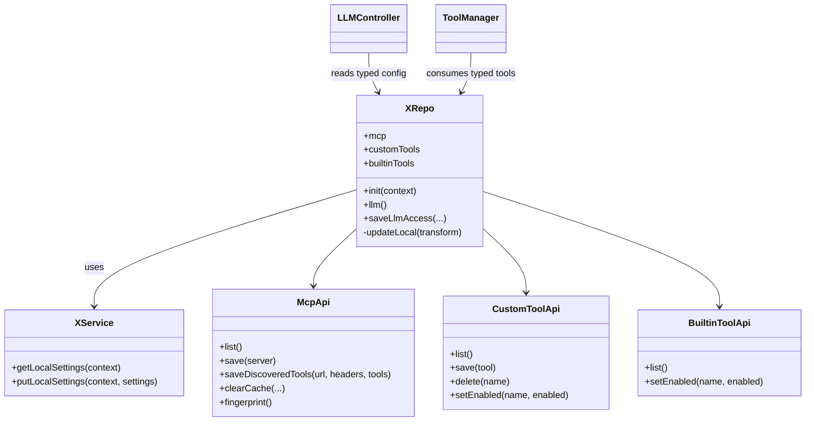

# 技术调研报告 v1.0

## 1. 需求概要

### 1.1 项目背景与目标
当前 Nexus 的本地配置读写以 `XService` + `LocalSettings` 为底层入口，但业务层仍在多处直接解析和构造 `JsonObject` / `JsonArray`。本项目目标是新增 `com.niki914.nexus.agentic.repo.XRepo` 作为统一、强类型、低记忆成本的配置读写门面，逐步迁移 MCP、CustomTool、BuiltinTool、LLM runtime 与 UI 调用方，避免 JSON 结构继续扩散。

### 1.2 核心功能清单
| 编号 | 功能名称 | 描述 | 优先级 |
|:-----|:---------|:-----|:-------|
| F-01 | XRepo 核心实现 | 在 `com.niki914.nexus.agentic.repo` 新增 `XRepo`，内部基于 `XService`，提供 init、context await、进程内写锁与强类型 codec | P0 |
| F-02 | XRepo 单元测试 | 覆盖 LLM、MCP、MCP cache、CustomTool、BuiltinTool flags 的解析与写回行为 | P0 |
| F-03 | MCP 与 cache 接入 | 将 MCP server、headers、discovered tools cache 的解析和写入收口到 `XRepo.mcp` | P0 |
| F-04 | Tool 接入 | 将 CustomTool 与 BuiltinTool 配置读写迁移到 `XRepo.customTools` / `XRepo.builtinTools` | P0 |
| F-05 | Runtime 与 UI 分批接入 | 逐步替换 `LLMController`、`ToolManager`、设置页 ViewModel 中直接依赖 `LocalSettings` JSON 的路径 | P1 |

### 1.3 约束条件
- **技术约束**: `XRepo` 第一版直接调用 `XService.getLocalSettings()` / `XService.putLocalSettings()`，不扩展 IPC provider 事务能力。
- **架构约束**: `XRepo` 必须按子域 API 解耦，避免本体随配置项增加而膨胀。
- **模型约束**: 强类型模型只覆盖调用方必须理解的业务概念，避免大而全的配置快照 data class。
- **迁移约束**: 调用方分批接入，每批回归完成后再进入下一批。
- **边界约束**: `App.kt` 当前调试 seed 逻辑本次暂时白名单，不作为第一批迁移目标。

### 1.4 验收标准
| 编号 | 验收项 | 通过条件 |
|:-----|:-------|:---------|
| AC-01 | XRepo 强类型 API | 新代码调用 `XRepo` 时不需要接触 `LocalSettings.props`、`JsonObject`、`JsonArray` |
| AC-02 | 写锁覆盖 | `XRepo` 内部对 `get -> transform -> put` 写回路径使用同一进程内 `Mutex` 包裹 |
| AC-03 | MCP headers 支持 | `XRepo.mcp.list/save` 能保留并写回 `headers: Map<String, String>` |
| AC-04 | MCP cache 支持 | `XRepo.mcp` 能按 url + headers 保存、读取、清理 discovered tools cache |
| AC-05 | Tool 迁移闭环 | CustomTool 与 BuiltinTool 配置读写不再由各 manager 自行拼装 JSON |
| AC-06 | 单元测试覆盖 | 新增测试覆盖解析、写回、保留未知字段、headers/cache、启用开关等关键路径 |

### 1.5 非功能性需求
- **可维护性**: 后续新增配置域时优先新增子域对象或内部 codec，不把所有方法平铺到 `XRepo` 本体。
- **兼容性**: 保持现有落盘 JSON key 兼容，包括 `provider`、`endpoint`、`api_key`、`model`、`mcp_servers`、`mcp_discovered_tools_cache`、`custom_tools`、`builtin_tool_flags`。
- **安全性**: CustomTool 命令校验继续复用现有 `ShellCommandSafetyPolicy` 语义。
- **稳定性**: 不在第一批引入 provider 事务改造，降低 IPC 边界回归风险。

## 2. 需求澄清记录
| 轮次 | 问题 | 用户回答 |
|:-----|:-----|:---------|
| Q1 | `XRepo` 内部读写方式选 `XService` 还是直接扩展 `XIpcBridge/provider`？ | 选择 A：直接调 `XService`，并在 `XRepo` 内加 mutex 锁 |
| Q2 | `XRepo` 对外 API 是子域拆分还是所有方法平铺？ | 选择 A：子域 API，避免 `XRepo` 膨胀 |
| Q3 | 迁移顺序是先核心与测试，再 MCP/cache，再 tool，再 UI/runtime，还是先 UI？ | 选择 A：先 `XRepo + tests`，再按业务分批接入 |

## 3. 审查摘要 (Quality Assurance)
- **PM 确认**: 本项目收益高且优先级高，能阻止 UI 新增/编辑页继续扩大 JSON 暴露面，也能为后续更多配置项提供统一入口。
- **架构师修正**: 不应把 `XRepo` 做成 `XService` 换皮；必须隐藏 raw JSON，并通过子域 API 与内部 codec 控制扩展性。
- **规范合规**: 第一版复用 `XService` 与现有 IPC/文件持久化能力，符合最小改动；进程内 `Mutex` 覆盖业务 read-modify-write，降低同进程竞态。

## 4. 选型对比表 (Technology Comparison)
| 方案 | 描述 | 复用度 | 改动量 | 风险 | 结论 |
|:-----|:-----|:-------|:-------|:-----|:-----|
| 方案 A: `XRepo` 基于 `XService` + 子域 API | 新增强类型业务门面，底层继续走 `XService`，按 `mcp/customTools/builtinTools` 拆分 | 高 | 中 | 低 | ✅ 推荐 |
| 方案 B: `XRepo` 直接改造 `XIpcBridge/provider` | 为配置写入引入更强事务能力，业务层同步迁移 | 中 | 高 | 中高 | ❌ 排除，超出第一阶段必要范围 |
| 方案 C: 只给 UI 新增 repository | UI 不再碰 JSON，但 runtime 与 manager 仍自行解析 | 中 | 低 | 中 | ❌ 排除，不能形成配置读写闭环 |

## 5. 现状映射表 (Context Map)
| PRD 功能点 | 现有代码逻辑/类 | 匹配度 | 备注 |
|:-----------|:---------------|:-------|:-----|
| 底层配置读写 | `XService.getLocalSettings()` / `putLocalSettings()` | ✅复用 | `XRepo` 第一版直接复用，不下钻 IPC provider |
| IPC 与持久化 | `XIpcBridge`、`XIpcStoreRepository`、`ConfigPersistence` | ✅复用 | 底层已有 store 级锁和 AtomicFile |
| MCP 解析 | `ToolManager.buildMcpServers()` | ⚠️重构 | 目前直接解析 `settings.mcpServers` 和 cache JSON |
| MCP cache 写入 | `McpDiscoveryCacheStore.persistDiscoveredTools()` | ⚠️重构 | 需要收口到 `XRepo.mcp.saveDiscoveredTools()` |
| CustomTool 写入 | `CustomToolManager.persist()` | ⚠️重构 | 目前自行读写 `custom_tools` JSON |
| BuiltinTool flags | `BuiltinToolSettingsManager.buildUpdatedSettings()` | ⚠️重构 | 需要收口到 `XRepo.builtinTools` |
| LLM runtime 刷新 | `LLMController.refresh()` | ⚠️重构 | 目前直接依赖 `HookLocalSettings.update()` 和 raw MCP JSON fingerprint |
| UI 设置页 | `McpSettingsContent`、`CustomToolsSettingsContent`、`ConfigureViewModel` | ⚠️重构 | 需要分批从 `XService/LocalSettings` 迁移到 `XRepo` |
| XRepo 源码 | 当前不存在 | ✨新增 | 新增包 `com.niki914.nexus.agentic.repo` |

## 6. 决策记录 (Decision Log)
| 决策点 | 讨论摘要 | 最终选择 | 理由 |
|:-------|:---------|:---------|:-----|
| `XRepo` 底层读写 | `XService` 复用 vs provider 事务扩展 | 方案 A: 复用 `XService` | 最小改动，符合当前低频并发判断，配合进程内 `Mutex` 足够覆盖主要风险 |
| API 组织方式 | 子域 API vs 方法平铺 | 方案 A: 子域 API | 后续配置项会增加，子域拆分能避免 `XRepo` 本体膨胀 |
| 迁移顺序 | 核心优先 vs UI 优先 | 方案 A: 核心与测试优先 | 先建立强类型底座，再逐批迁移调用方，便于回归 |

## 7. 方案概要
- **选定方案**: `XRepo` 基于 `XService` 的强类型子域门面。
- **核心思路**: 新增 `XRepo` 与少量业务模型，对外提供 `llm`、`mcp`、`customTools`、`builtinTools` 等低记忆成本 API；内部集中做 `LocalSettings` JSON codec 与写锁管理；调用方分批接入。
- **YAGNI 删减**: 第一阶段不改造 IPC provider 事务，不引入大而全 `NexusLocalConfig` 快照，不一次性迁移所有 UI 和 runtime。
- **备选方案**: 直接 provider 改造范围过大；只改 UI 无法阻止 runtime/manager JSON 扩散。

## 8. 详细变更方案 (Detail Plan)

### 8.1 核心类修改
**新增包**: `com.niki914.nexus.agentic.repo`
- 新增 `XRepo` object：负责 `init(context)`、context await、内部 `updateLocal` 写锁、强类型子域入口。
- 新增轻量模型：`LlmConfig`、`McpServer`、`McpTool`、`CustomTool`，只保留调用方需要理解的概念。
- 新增 internal codec/helper：负责 `LocalSettings.props` 与强类型模型互转，调用方不可见。

**修改 `ToolManager`**
- 从直接解析 `LocalSettings` 逐步迁移为消费 `XRepo` 输出的强类型 MCP/CustomTool/BuiltinTool 配置。

**修改 `McpDiscoveryCacheStore`**
- 保留 response 解析职责，写入改为 `XRepo.mcp.saveDiscoveredTools()`。

**修改 `CustomToolManager` / `BuiltinToolSettingsManager`**
- 保留校验和 registry 逻辑，持久化读写改为通过 `XRepo` 子域完成。

**修改 `LLMController`**
- `refresh(context)` 初始化 `XRepo`，使用 `XRepo.llm()` 与 `XRepo.mcp.fingerprint()`，并在 MCP refresh 失败时通过 `XRepo.mcp` 清理相关 cache。

### 8.2 业务流程
1. UI 或 Hook 拿到 Context 后调用 `XRepo.init(context)`。
2. 调用方通过 `XRepo.llm()`、`XRepo.mcp.list()`、`XRepo.customTools.list()` 获取强类型配置。
3. 写入路径统一进入 `XRepo` 子域 API。
4. `XRepo` 内部持有进程内 `Mutex`，在写回前读取最新 `LocalSettings`，只更新目标 key 后调用 `XService.putLocalSettings()`。
5. LLM runtime 通过强类型配置构建 session tools，不再从 raw JSON 推导 MCP fingerprint。

## 9. 架构建模 (Mermaid)

## 10. 难点预判与风险
| 风险项 | 严重度 | 缓解策略 |
|:-------|:-------|:---------|
| data class 膨胀导致调用方记忆成本增加 | P0 | 只新增业务必需模型，不暴露全量 settings snapshot |
| 迁移中同一配置同时存在新旧读写路径 | P0 | 按批迁移，每批完成后检查对应业务不再直接拼装 JSON |
| MCP headers/cache 写回误删未知字段 | P1 | codec 写回时只替换目标 key，MCP server 模型保留 headers |
| ToolManager 测试与新模型不匹配 | P1 | 先新增 XRepo 单元测试，再改造 ToolManager 测试 |
| `App.kt` 调试 seed 覆盖配置 | P1 | 本次白名单保留，但在后续正式化任务中单独收口 |

## 11. 开放问题
| 编号 | 问题 | 影响范围 | 状态 |
|:-----|:-----|:---------|:-----|
| Q-01 | `ToolManager` 是否完全移除 `resolve(settings: LocalSettings)`，还是先保留兼容 overload | `ToolManager` 迁移批次 | Phase 1 设计时确定 |
| Q-02 | `McpDiscoveryCacheStore` 是否保留为 response 解析 wrapper，还是整体并入 `XRepo.mcp` | MCP/cache 迁移批次 | Phase 1 设计时确定 |
